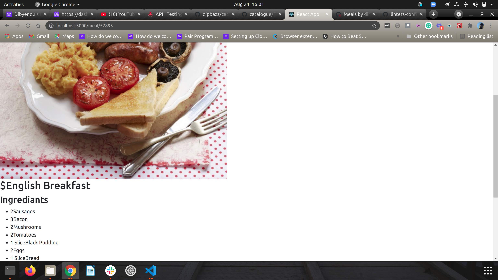

# Catalogue
Project to show different mealsusing mealdb API.

## Built with
- React.js

## Live Demo
- [Live demo link] (https://musing-booth-d1bd1f.netlify.app/)
## Getting Started

- Clone the repo `https://github.com/dibdas/catalogue.git`
- cd `into` the project
- Run `yarn install` or `npm install` to install dependencies
- On the terminal run `npm run start` open up the live server

## Author

👤 **Dibyendu Das**
- Github: [@dibdas](https://github.com/dibdas)
- Twitter: [@dibyend78120480](https://twitter.com/dibyend78120480)
- Linkedin: [Dibyendu Das](https://www.linkedin.com/in/dibdas/)

## 🤝 Contributing

Contributions, issues and feature requests are welcome!

Feel free to check the [issues page](issues/).

## Show your support

Give a ⭐️ if you like this project!

## 📝 License

This project is [MIT](./LICENSE) licensed.
